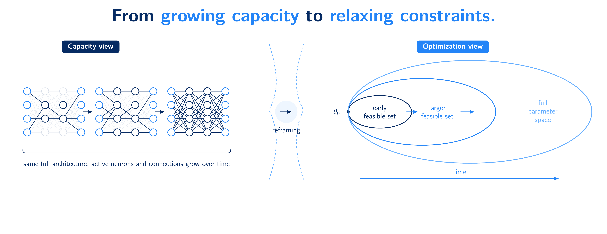

# Across the Loss Landscape with Progressive Growth

Official implementation of **“Across the Loss Landscape with Progressive Growth”** by Paul Caillon, Christophe Cerisara, and Alexandre Allauzen.

**Paper:** [arXiv:2608.24568](https://arxiv.org/abs/2608.24568)

<p align="center">
  
</p>

<p align="center">
  <em>
    Progressive growth viewed as progressive constraint relaxation:
    training moves through nested feasible sets until the full parameter
    space is recovered.
  </em>
</p>

## Overview

Deep neural networks generalize well despite their highly nonconvex and overparameterized loss landscapes. A common explanation relates this behavior to the geometry of the minima reached by stochastic optimization, with flatter minima often associated with better generalization.

In this work, we study how **incremental grow-and-optimize strategies** affect the regions of the loss landscape reached during training.

We interpret progressive growth as a form of **progressive constraint relaxation**. Training starts in a low-dimensional submodel: only a subset of parameter directions is trainable, while the orthogonal complement remains frozen at initialization. The trainable subspace is then progressively expanded through nested random subspaces, with re-optimization after each expansion, until the full parameter space is recovered.

Under standard local regularity assumptions around non-degenerate minima, local sublevel sets can be approximated by ellipsoids. This makes it possible to characterize basin accessibility under frozen constraints through the curvature of the loss in the frozen directions.

The resulting picture is more nuanced than simply “progressive growth finds flatter minima”:

* when candidate basins have comparable accessibility, progressive growth induces a **volume bias favoring wider/flatter basins**;
* basin location and accessibility also matter, and can compete with or even dominate this volume effect;
* in neural-network experiments, progressive growth can substantially reduce curvature without systematically improving test performance.

These results highlight both the geometric bias induced by progressive training and the subtleties of the relationship between flatness and generalization.

---

## Repository structure

```text
.
├── configs/                    # Experiment configurations
├── progressive_growth/        # Progressive subspace training implementation
├── scripts/                    # Scripts for reproducing experiments
├── toy/                        # Controlled loss-landscape experiments
├── main.py                     # Main neural-network experiment entry point
├── plot.py                     # Plotting utilities
└── requirements.txt            # Python dependencies
```

---

## Installation

Clone the repository and create a Python environment:

```bash
git clone https://github.com/p0lcAi/Across-the-Loss-Landscape.git
cd Across-the-Loss-Landscape

python -m venv .venv
source .venv/bin/activate

pip install -r requirements.txt
```

The neural-network experiments use PyTorch and require downloading CIFAR-100. A CUDA-capable GPU is strongly recommended for the ResNet-18 experiments.

The controlled toy experiments are substantially cheaper and can be run on CPU.

---

## Progressive growth

Let the network parameters be represented in a nested sequence of trainable subspaces

$$
\mathcal{S}_1 \subset \mathcal{S}_2 \subset \cdots \subset \mathcal{S}_S,
$$

where the final stage recovers the full parameter space.

At each stage, optimization is restricted to the current trainable subspace while its orthogonal complement remains frozen. Increasing the stage therefore progressively relaxes the constraints imposed on the optimization problem.

The code supports several growth strategies and transition criteria used in the experiments.

---

## Controlled landscape experiments

The toy experiments isolate the geometric mechanisms studied in the paper.

### Multiplicity / volume bias

In the multiplicity experiment, flat and sharp basins are placed at the same location. Accessibility differences due to basin position are therefore removed, allowing the curvature/volume effect to be isolated.

Run:

```bash
bash scripts/run_toy_multiplicity.sh
```

As the number of progressive stages increases, the probability of selecting a flat basin increases, while the expected curvature of the selected solutions decreases.

This illustrates the **volume bias toward wider basins** induced by progressive constraint relaxation.

### Accessibility–volume tradeoff

The second experiment introduces a competing effect: sharp basins are placed closer to the constrained optimization trajectory, while flatter basins are farther away.

Run:

```bash
bash scripts/run_toy_tradeoff.sh
```

In this regime, accessibility can dominate the volume advantage of flatter basins. Increasing the number of stages can therefore favor sharper but more accessible solutions.

This experiment illustrates an important point of the analysis: **progressive growth does not unconditionally select the flattest available minimum**. Basin geometry and basin accessibility jointly determine which regions can be reached.

---

## ResNet-18 on CIFAR-100

The main neural-network experiments train ResNet-18 on CIFAR-100 and compare standard full-network training with progressive subspace growth.

The principal experiment is configured in:

```text
configs/resnet_cifar100_main.yaml
```

Run:

```bash
python main.py --config configs/resnet_cifar100_main.yaml
```

The experiments compare standard training against progressive growth with different numbers of stages and transition criteria.

We measure both predictive performance and local geometric quantities, including estimates of the largest Hessian eigenvalue and Hessian trace.

### Main empirical observation

Progressive growth reaches solutions with substantially different local curvature from standard full-network training. In particular, several progressive-growth configurations produce markedly lower estimates of the largest Hessian eigenvalue.

However, these curvature reductions do **not** systematically translate into higher test accuracy.

This provides an empirical counterpart to the theoretical analysis: progressive growth biases optimization toward particular regions of the loss landscape, but flatness alone does not provide a universal explanation of generalization performance.

---

## Transition criteria

The experiments include growth schedules based on validation accuracy and training loss.

For the main `train_loss` experiments, stage transitions use the scheduled-growth configuration specified in the experiment config. This ensures that the requested number of progressive stages is actually traversed during training.

The dedicated patience experiment instead studies transition behavior driven directly by the training-loss criterion.

---

## Internal controls

Additional experiments separate progressive growth from related parameter-restriction effects.

The controls are defined in:

```text
configs/resnet_cifar100_internal_controls.yaml
```

Run:

```bash
python main.py --config configs/resnet_cifar100_internal_controls.yaml
```

They include comparisons with:

* **full-network training**, where all parameters are trainable from the beginning;
* **fixed-subspace training**, where optimization remains restricted to the initial subspace;
* **one-shot expansion**, where the parameter space is expanded directly rather than through multiple progressive stages.

These controls help distinguish the effect of **progressive constraint relaxation** from the effect of simply optimizing in a restricted parameter space.

---

## Training-loss patience experiment

The training-loss transition criterion can be studied separately using:

```text
configs/resnet_cifar100_patience_trainloss_s10.yaml
```

Run:

```bash
python main.py --config configs/resnet_cifar100_patience_trainloss_s10.yaml
```

This experiment is intended to study the behavior of patience-based transitions and should not be confused with the scheduled `train_loss` runs used in the main experiment.

---

## Outputs

Experiment results are written under:

```text
outputs/
```

Depending on the experiment, the generated outputs include per-run metrics, aggregate summaries, transition diagnostics, curvature measurements, and data used for plotting.

The output directory is intentionally excluded from version control.

---

## Reproducing the paper experiments

The main experiments can be reproduced with:

```bash
# Controlled landscapes
bash scripts/run_toy_multiplicity.sh
bash scripts/run_toy_tradeoff.sh

# Main ResNet-18 / CIFAR-100 experiments
python main.py --config configs/resnet_cifar100_main.yaml

# Internal controls
python main.py --config configs/resnet_cifar100_internal_controls.yaml

# Training-loss patience experiment
python main.py --config configs/resnet_cifar100_patience_trainloss_s10.yaml
```

The configuration files contain the experimental parameters and random seeds used for the corresponding experiments.

Running all ResNet-18 configurations can require substantial GPU compute. The toy experiments provide a lightweight way to reproduce the core geometric phenomena without training neural networks.

---

## Citation

If you use this work, please cite:

```bibtex
@article{caillon2026across,
  author        = {Caillon, Paul and Cerisara, Christophe and Allauzen, Alexandre},
  title         = {Across the Loss Landscape with Progressive Growth},
  journal       = {arXiv e-prints},
  year          = {2026},
  month         = aug,
  eprint        = {2608.24568},
  archivePrefix = {arXiv},
  primaryClass  = {stat.ML}
}
```
